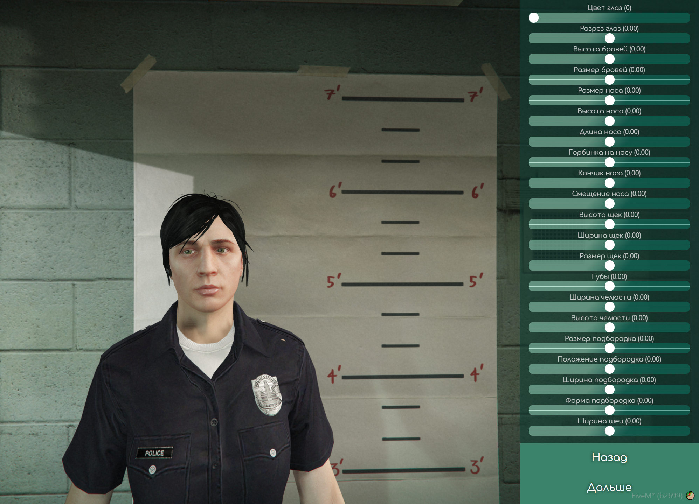
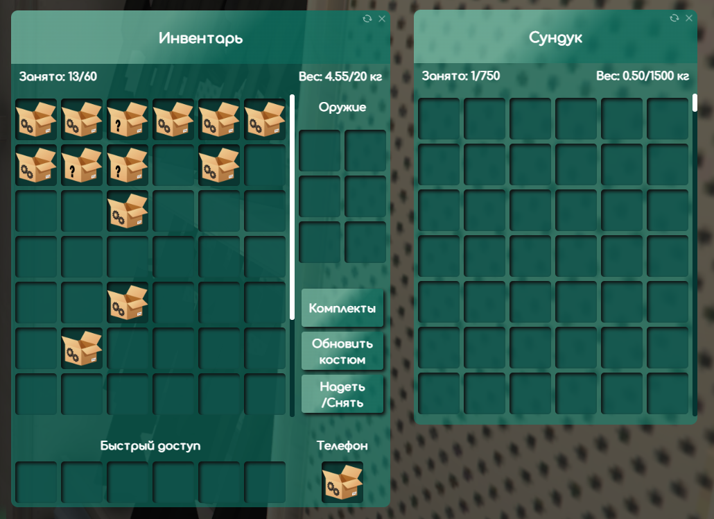
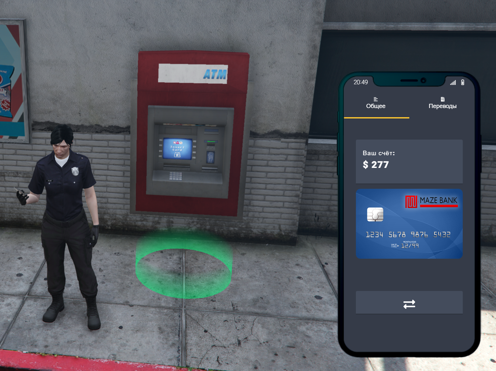
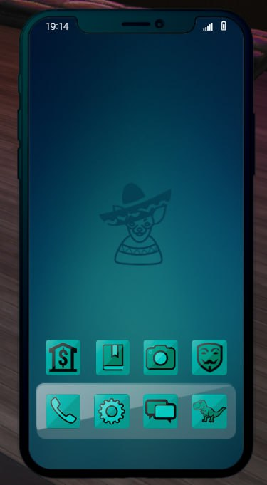
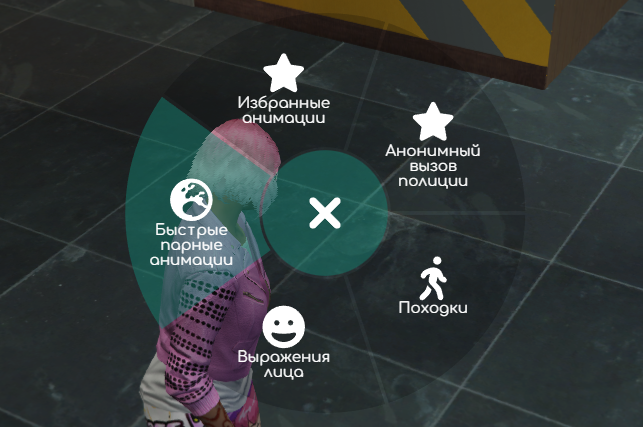
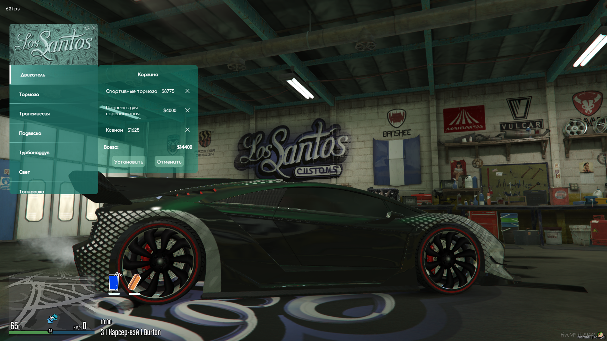
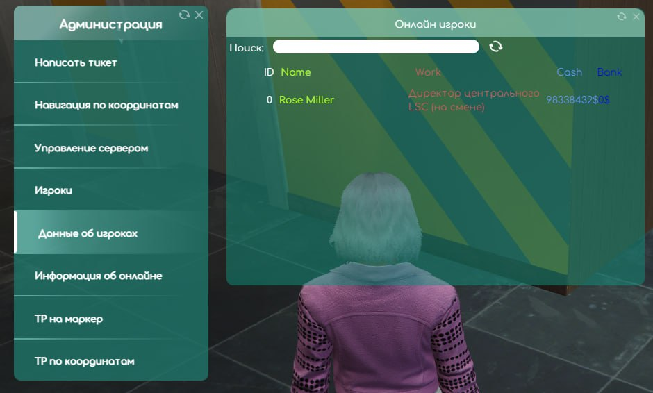
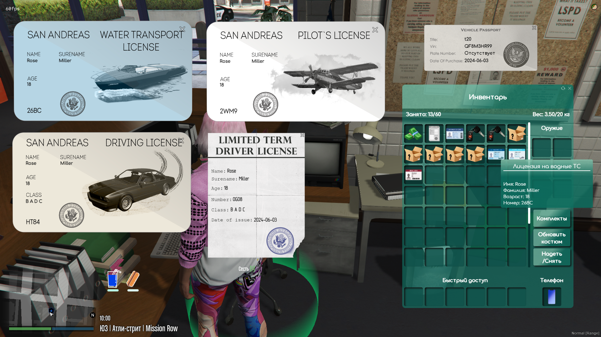
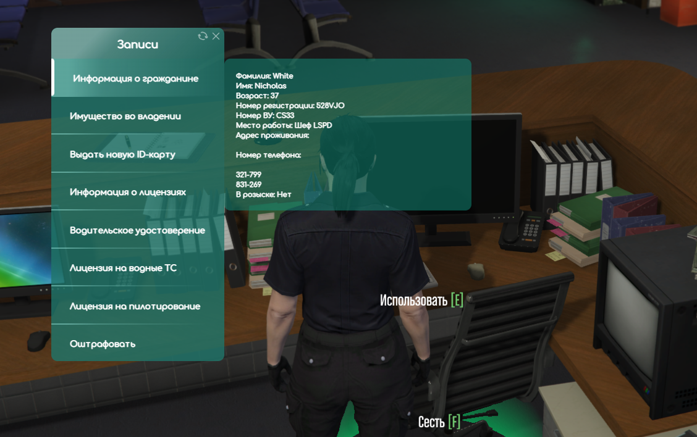
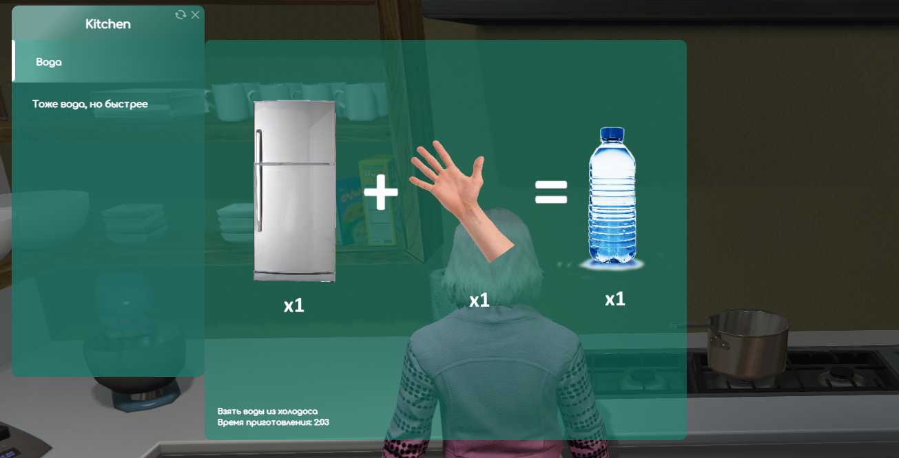

**Описание** 
Название: NewLine RP 
Платформа: FiveM/GTA V 
Языки: Lua/JS/C# 
Используемые фреймворки: vRP (Lua), Node.js, jQuery, Vue.js, Discord.js 
 
В этом разделе репозитория представлен мой пет-проект RP сервера в GTA V, который мы с командой разрабатываем в свободное время. 
Моя роль на этом проекте - главный программист. Я отвечаю за бóльшую часть кода проекта - сервер, клиент, логика и стили интерфейса (HTML/JS/CSS), взаимодействие всех модулей. 
За основу был взят Lua фреймворк для FiveM под названием vRP. За время разработки, в связи с нуждами проекта, около 70% кода этого фреймворка были полностью переработаны (см. "Разработанные модули/системы"), а также написано множество собственных модулей (расширений) vRP. 
 
> По объективным причинам, исходный код проекта предоставить не могу, поэтому прикладываю скриншоты и описание модулей. 
 
**Разработанные модули/системы** 
 
Здесь будут перечислены модули и системы, присутствующие в нашем проекте, которые я разработал или переработал за время ведения разработки. 
 
* Система создания и кастомизации персонажа. 

 

* Система инвентарей и сундуков 

 

* Система денег (банк и наличка) - привязана к системе телефона (приложение) и инвентаря (деньги хранятся как предмет) 

 

* Система телефона - взятый из интернета, но сильно переработанный скрипт. Имеет в себе множество встроенных приложений, но взяты в итоговую версию только 6. 2 приложения разработаны с нуля. В планах сделать "магазин" приложений с большим их выбором. 

 

* Радиальное меню - меню для быстрого доступа к конкретным функциям, исходя из текущего состояния персонажа 

 

* Быстрый доступ через G меню - при зажатии G появляется линия, игрок наводит на какой-то активный объект (авто, проп, NPC, другой игрок) и при отпускании появляется контекстное меню для взаимодействия с этим объектом. 
* Система меню - существовала из коробки, но была доработана (дизайн, вставка нескольких изображений в описание, корзина товаров в магазинах) 
* Система автомобилей и взаимодействия с ними - покупка, хранение в гражах, продажа, аренда, служебные автомобили (полиция, такси, медики и т. д.), тюнинг и кастомизация, сохранение состояния при перезагрузке, документы на авто, права на вождение, выдача штрафов, передача авто другому человеку и т. д. 

 

* Список игроков на сервере для администрации 

 

* Система документов - интерфейс, создание фотографий персонажа для ID-карты (паспорта), пустые бумажки для создания записок, штрафы, различные виды прав и т. д. 

 

* Полицейский функционал - поиск в базе, штрафы, конфискация, КПЗ/тюрьма, регистрация ТС, вызов полиции, погоня, отдельные пропы полиции, автомобильные радары в машинах полиции и на вертолётах 

 

* Система отношения различных банд друг к другу и к игроку, настраиваемая главами банд 
* Система квартир/домов/отелей - покупка, продажа, выдача администрацией, аренда, домофон 
* Система бизнесов - бизнесы довольно похожи между собой, у каждого имеется список ролей, различные метки (сундуки, кухня, гараж, спец. метки и т. д.), настраиваются через cfg и выдаются мэрией 
* Система крафта - не ограничена получением предметов из других предметов. Также можно получать из предметов деньги (продажа персиков) или из ничего очки характеристик (спорт зал, учебники) 

 

* Фарм-профессии - сбор фруктов на ферме и перепродажа, добыча золота и т. д. 
* Система пропов - можно положить в руку (прикрепить к персонажу), можно выложить в мир, настроить положение в пространстве 
* Интеграция с Discord - логирование передачи предметов, удобное создание отчётов для полиции/медиков, фотографии персонажей и т. д. 
* Личные настройки для каждого игрока 
* Развлекательные системы и интерактивность предметов - гольф, скейтборд, Youtube-колонка, каталки медиков, инвалидные коляски 
 
 
 
